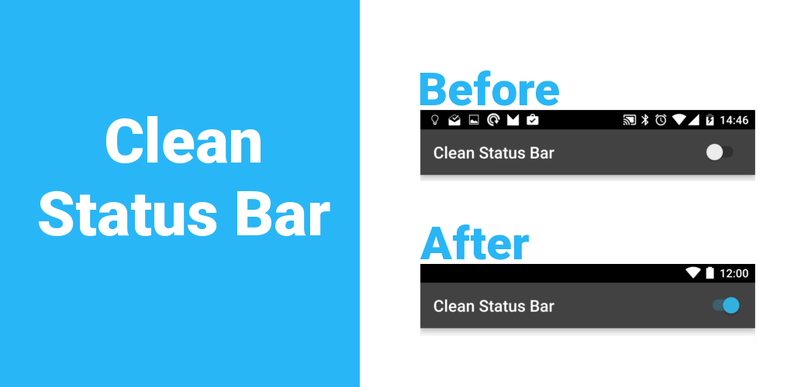
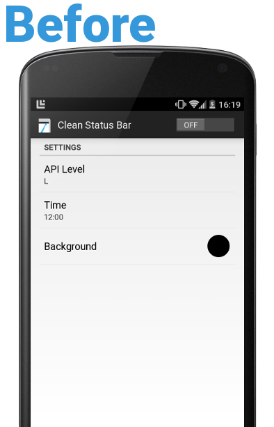
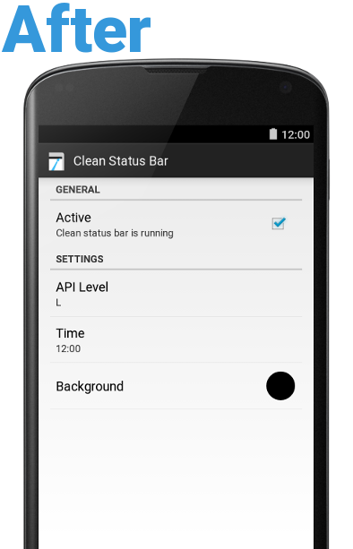
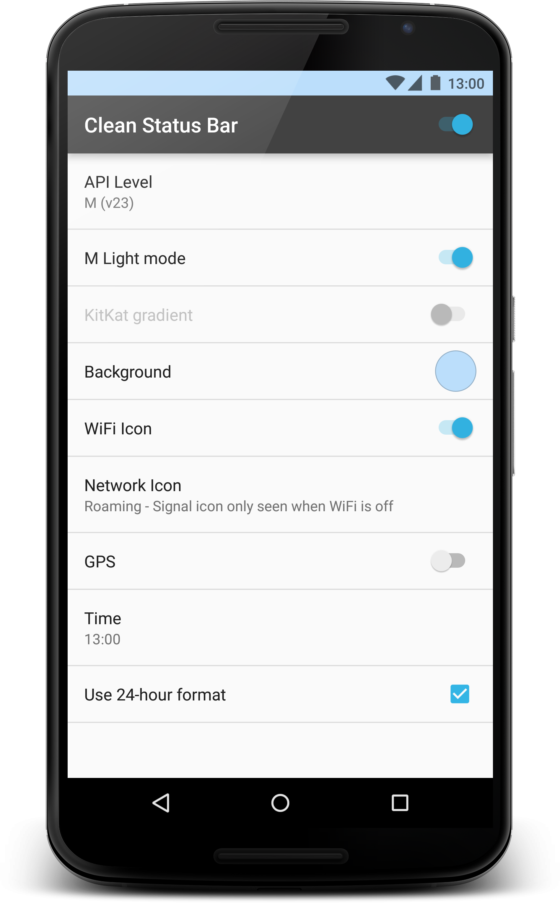

Clean Status Bar
=================================

Tired of Photoshopping out notifications/low battery to make a nice, clean status bar for the Play Store? Run this app first - it draws over your status bar, showing only a full battery and clock.

It runs as a service, so you can swap to other apps to take screenshots.





App available [here](https://play.google.com/store/apps/details?id=com.emmaguy.cleanstatusbar) or in [Releases](https://github.com/emmaguy/clean-status-bar/releases)

Use the `ToggleReceiver` to enable/disable Clean Status Bar programmatically, e.g. to automate taking screenshots.

```java
final Bundle extras = new Bundle();
extras.putBoolean("enabled", true);

final Intent intent = new Intent("com.emmaguy.cleanstatusbar.TOGGLE");
intent.putExtras(extras);

sendBroadcast(intent);
```

[](https://travis-ci.org/emmaguy/clean-status-bar)

For more information about the creation and ongoing maintainence of this project, [read the blog post](https://medium.com/@emmaguy/death-to-ugly-android-screenshots-48ea071d912e)

License
--------

    Copyright 2014-2015 Emma Guy

    Licensed under the Apache License, Version 2.0 (the "License");
    you may not use this file except in compliance with the License.
    You may obtain a copy of the License at

       http://www.apache.org/licenses/LICENSE-2.0

    Unless required by applicable law or agreed to in writing, software
    distributed under the License is distributed on an "AS IS" BASIS,
    WITHOUT WARRANTIES OR CONDITIONS OF ANY KIND, either express or implied.
    See the License for the specific language governing permissions and
    limitations under the License.
